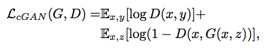
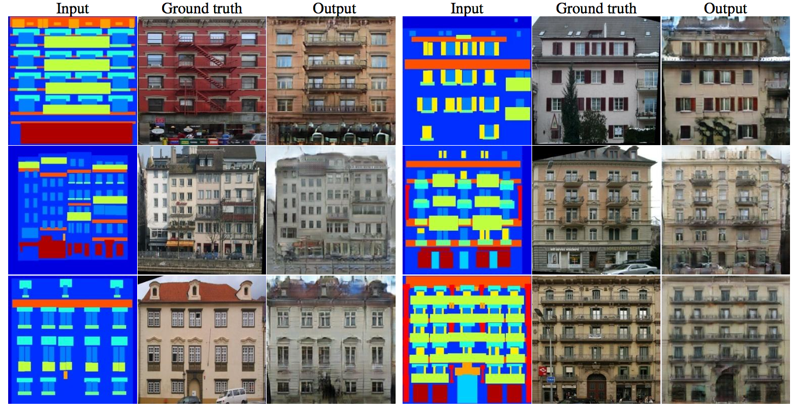
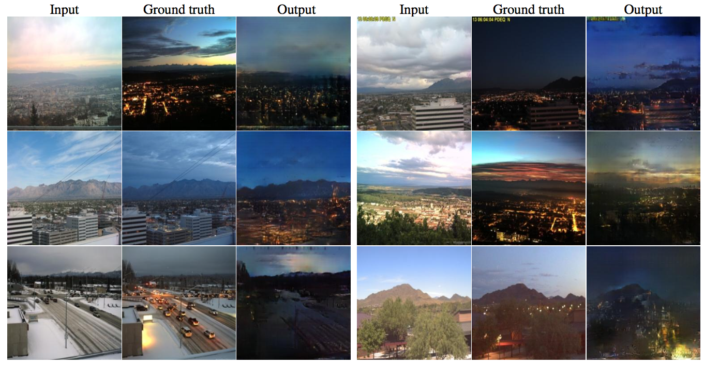
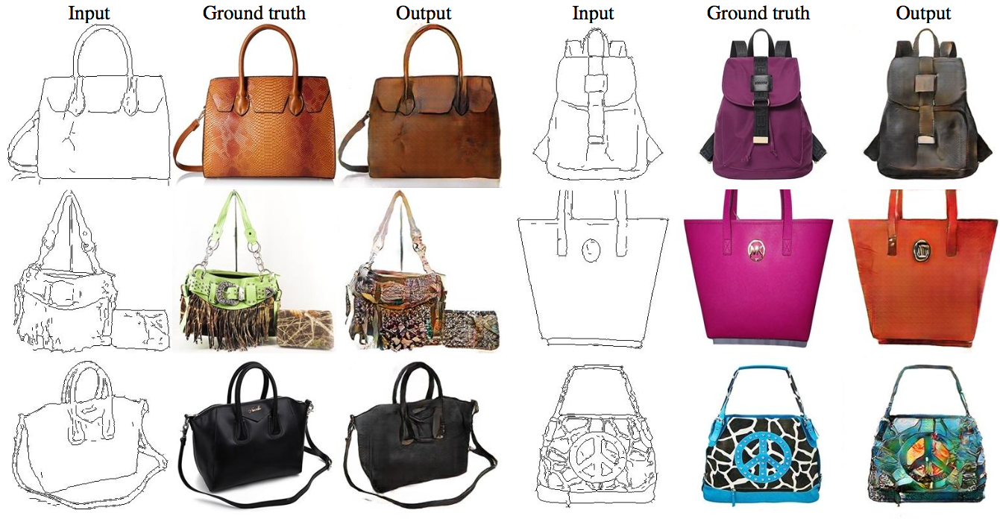
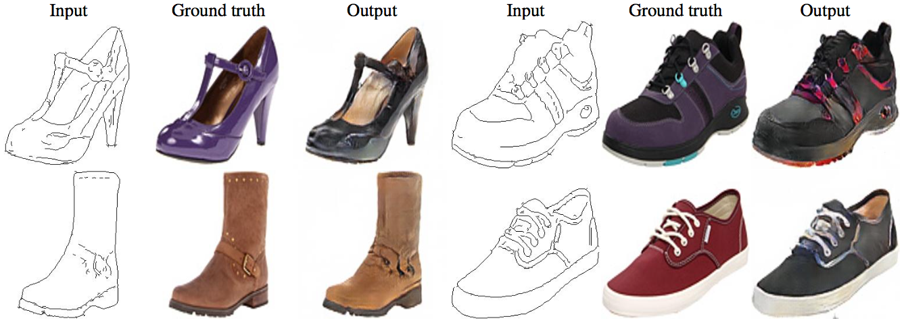

# HW2-style-transfer

## To-Do

1.  Training （MUNIT）
2.  Inference one image in multiple style
3.  Compare with other method

## 需先安裝如下套件: pytroch, anaconda的pip, pyyaml, tensorborad

```
conda install pytorch=0.4.1 torchvision cuda91 -c pytorch;
conda install -y -c anaconda pip;
conda install -y -c anaconda pyyaml;
pip install tensorboard tensorboardX;
```
## 1. 訓練本專案結果流程（Training （MUNIT））
### Step1 下載資料集（Dataset）

- `bash scripts/demo_train_edges2handbags.sh`  
- `bash scripts/demo_train_edges2shoes.sh` 
- `bash scripts/demo_train_summer2winter_yosemite256.sh` 

### Step2 進行訓練（Train）

```
python train.py --config configs/edges2handbags_folder.yaml
```
### Step3 進行訓練（Test）
```
 python test.py --config configs/edges2shoes_folder.yaml --input inputs/edges2shoes_edge.jpg --output_folder results/edges2shoes --checkpoint models/edges2shoes.pt --a2b 1 
 
 ``` 
### Edges to Shoes/handbags Translation

### Animal Image Translation

### Street Scene Translation


## 2. 多樣風格 Inference one image in multiple style
我們參考 [BicycleGAN](https://github.com/junyanz/BicycleGAN)中的Day2night風格，實際在訓練與測試一次，詳細步驟同Training （MUNIT），結果顯示如下：


## 3.  比較其他方法（Comapre with other Method)

除了BicycleGAN方法，我們也參考 [Pixel2Pixel](https://github.com/junyanz/pytorch-CycleGAN-and-pix2pix)

Pix2Pix框架基於GAN，既然是基於GAN框架，那麼首先先定義輸入輸出。普通的GAN接收的G部分的輸入是隨機向量，輸出是圖像；D部分接收的輸入是圖像(生成的或是真實的)，輸出是對或者錯。這樣G和D聯手就能輸出真實的圖像。

但對於圖像翻譯任務來說，它的G輸入顯然應該是一張圖x，輸出當然也是一張圖y。但是D的輸入卻應該發生一些變化，因為除了要生成真實圖像之外，還要保證生成的圖像和輸入圖像是匹配的。

### 訓練細節 
1.	梯度下降，G、D交替訓練
2.	使用Adam演算法訓練
3.	在inference的時候，與train的時候一樣，這和傳統CNN不一樣，因為傳統上inference時dropout的實現與train時不同。
4.	在inference的時候，使用test_batch的資料。這也和傳統CNN不一樣，因為傳統做法是使用train set的資料。
5.	batch_size = 1 or 4，為1時batch normalization 變為instance normalization

Pix2Pix的損失函數為


為了做對比，同時再去訓練一個普通的GAN，即只讓D判斷是否為真實圖像。


### 結果圖





## Reference
1. [style_transfer](https://github.com/gsurma/style_transfer?fbclid=IwAR2N1kEStC4fd-N_f6wrfEkdBLt967jFWrWZLBDfdpPmLCnYjrjvTfZv7QI)
2. [fast-style-transfer](https://github.com/lengstrom/fast-style-transfer?fbclid=IwAR0r4ZoAnlc7VIK_JNq4-gU3aajppPyM52uX9wYRelfUY7t3-n-vL91pJFU)
