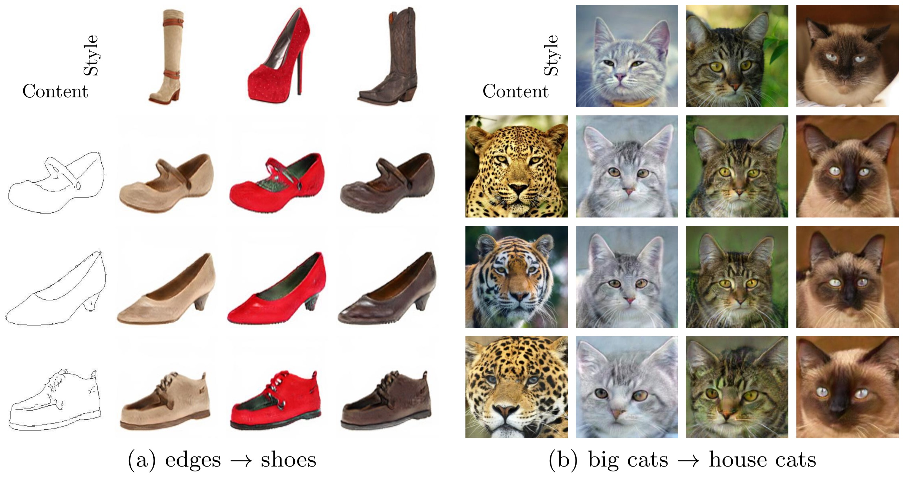

# HW2-style-transfer

## To-Do

1.  Training （MUNIT）
2.  Inference one image in multiple style
3.  Compare with other method

## 需先安裝如下套件: pytroch, anaconda的pip, pyyaml, tensorborad

```
conda install pytorch=0.4.1 torchvision cuda91 -c pytorch;
conda install -y -c anaconda pip;
conda install -y -c anaconda pyyaml;
pip install tensorboard tensorboardX;
```
## 1. 訓練本專案結果流程（Training （MUNIT））
### Step1 下載資料集（Dataset）

- `bash scripts/demo_train_edges2handbags.sh`  
- `bash scripts/demo_train_edges2shoes.sh` 
- `bash scripts/demo_train_summer2winter_yosemite256.sh` 

### Step2 進行訓練（Train）

```
python train.py --config configs/edges2handbags_folder.yaml
```
### Step3 進行訓練（Test）
```
 python test.py --config configs/edges2shoes_folder.yaml --input inputs/edges2shoes_edge.jpg --output_folder results/edges2shoes --checkpoint models/edges2shoes.pt --a2b 1 
 
 ``` 
### Edges to Shoes/handbags Translation

### Animal Image Translation

### Street Scene Translation

### Yosemite Summer to Winter Translation (HD)

### Example-guided Image Translation


## 2. 多樣風格 Inference one image in multiple style
我們參考 [BicycleGAN](https://github.com/junyanz/BicycleGAN)中的Day2night風格，實際在訓練與測試一次，詳細步驟同Training （MUNIT），結果顯示如下：


